# Rock, Paper, Scissors, Lizard, Spock Game

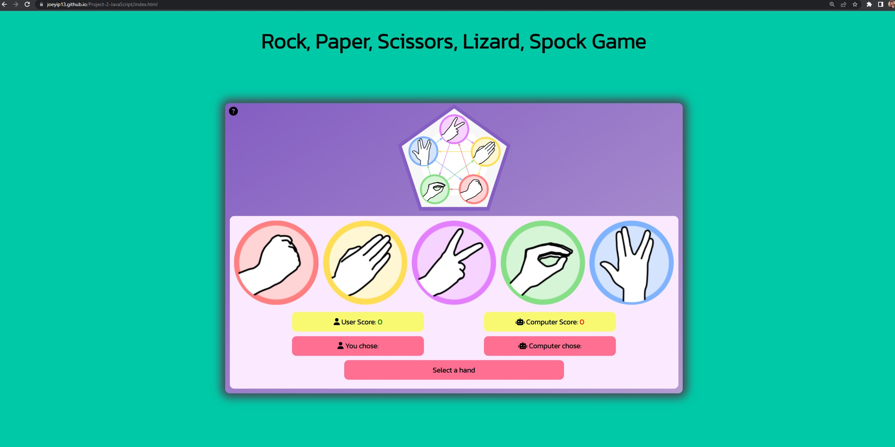

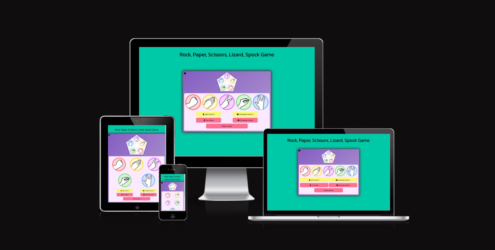

[Rock, Paper, Scissors, Lizard, Spock Game](https://joeyip13.github.io/Project-2-JavaScript/) is designed as a interactive game. Its goal is to bring a fun user interactive experience. 

## Table of Contents 

1. 

    
<a href="#ux">UX</a>

    <ul>
    <li>

    
<a href="#goals">Goals</a>

    - [Visitor Goals](#visitor-goals)
    - [Business Goals](#business-goals)
    - [User Stories](#user-stories)
    
</li>

    <li>

    
<a href="#visual-design">Visual Design</a>

    - [Figma](#figma)
    - [Logo](#logo)
    - [Buttons](#buttons)
    - [Modal](#modal)
    - [Fonts](#fonts)
    - [Icons](#icons)
    - [Colors](#colors)
    - [Images](#images)
    - [Styling](#styling)
    
</li>
    </ul>

2. 

    
<a href="#features">Features</a>

   <ul>
    
<a href="#index-page">Index page</a>

    
</li>

    <li>

    
<a href="#feature-ideas">Feature Ideas</a>

    - [Future Feature Ideas](#future-feature-ideas)
    
</li>
    </ul>

3. 

    
<a href="#testing">Testing</a>

    <ul>
    <li>

    - [Validation](#validation)
    - [General Testing](#general-testing)
    - [PageSpeed Insights](#pagespeed-insights)

    </li>
    </ul>
    

4. 

    
<a href="#deployment">Deployment</a>

    <ul>
    <li>

    - [GitHub](#git-hub)

    </ul>
    </li>
    

5. 

    
<a href="#credits">Credits and Contact</a>

    <ul>
    <li>

    - [Credit](#credit)
    - [Content](#content)
    - [Media](#media)
    - [Contact](#contact)

    </ul>
    </li>
    

----

# UX 
## Goals 
### Visitor Goals 
The target audience for Rock Paper Scissors Lizard Spock Game:
- Children under the ages of 16 
- People who are interested in beating the computer in a game. 
- People who are looking for a rock paper scissors game.

### Business Goals 
The Business Goals of Rock Paper Scissors Lizard Spock Game:
- Give the user a interactive gaming experience against the computer. 
- Enjoy the animations and effects from the game.  

### User Goals 
User Goals are: 
- Display a clean easy to navigate game. 
- Display a cool and interactive display of visuals to give the user a good user experience.  

### User Stories
- As a user interested in the game, I expect to see a clean layout and easy to navigate controls.

## Visual Design
### Figma
Figma was used in this process to help layout the structure and design of the website. Initially I planned to have buttons with the name of the each button below the images as shown in the Figma design. But throughout the development stages, I decided to use the images as the buttons itself. 
The white background changed from plain white to the color I used in the buttons. This was suggested by my mentor and it highlighted the main game better. 

For desktop:

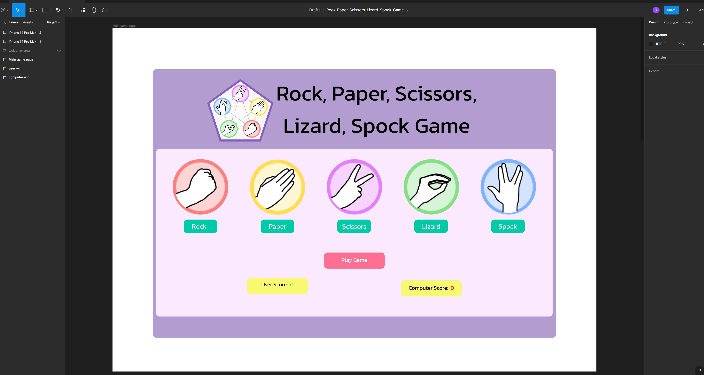

For Mobile:

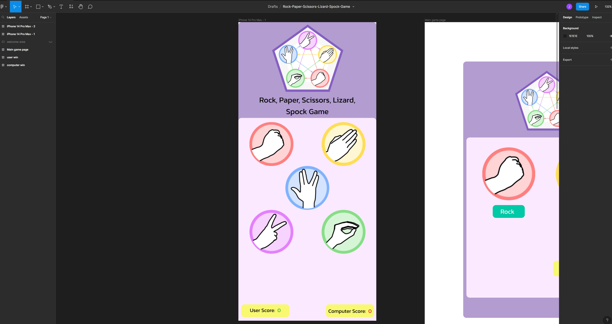

### Logo
Adobe Express was used to create the logo and the game buttons   

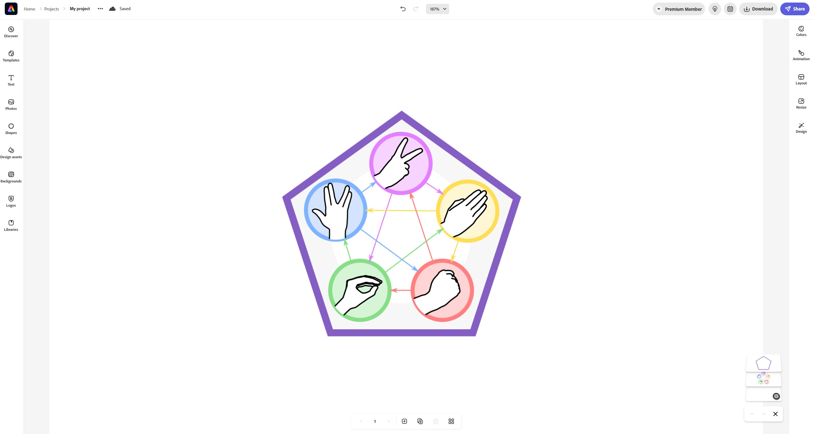

### Buttons
Game buttons was designed on Adobe Express. For the game images I simply cropped the different hand images in the logo into individual images and used them as the primarily game buttons. 

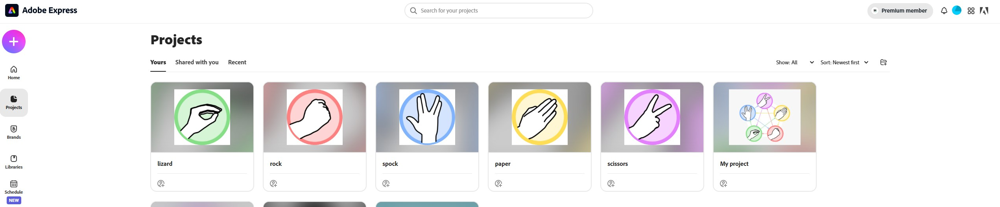

### Modal
I wanted to create a modal that displays the game rules. I followed a great tutorial help from [freecodecamp](https://www.freecodecamp.org/news/how-to-build-a-modal-with-javascript/) I like the concept of a modal to display another page on top of the main game area. It brings the interaction of the gaming experience more visually engaging. 

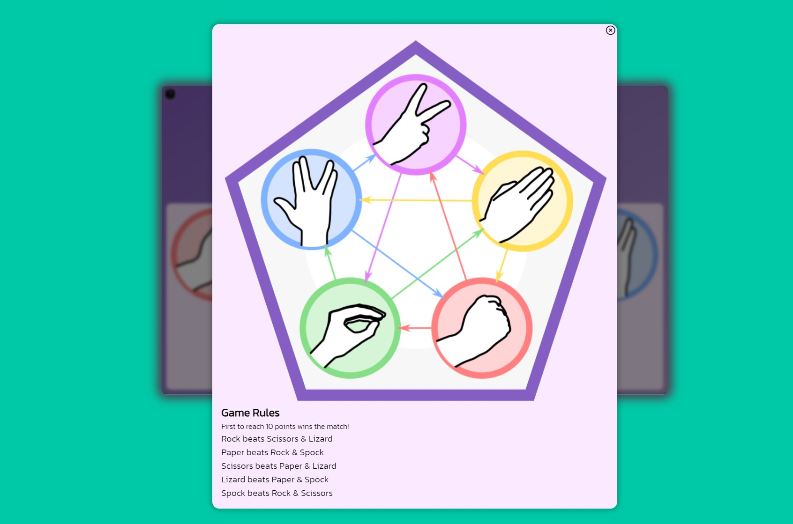

### Fonts 
- Primary font was Kanit 300. I chose this font because it showed a arcade like font style which ideal for a game. 

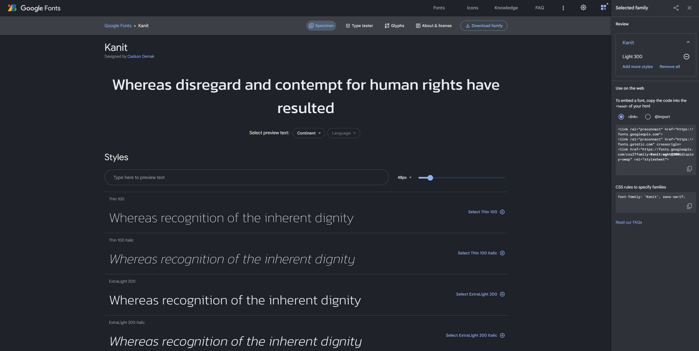

### Icons

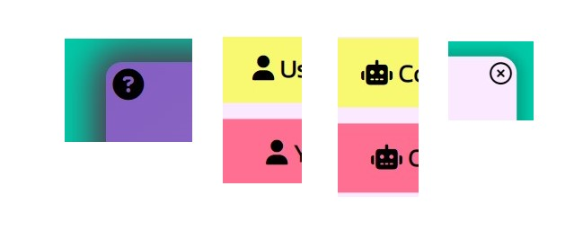

- Icons are taken from the [Font Awesome](https://fontawesome.com/) Icon library and are utilised as classes in the `<i>` tag.
- Icons are utilised in the game for user and computer display. The question mark icon is used to open the game rules modal and the "xmark" icon is used to close the modal screen.

### Colors 

- I wanted the game quite bold with bright colors. Inspiration of the use of the colors were taken from the logo.5 different buttons so I used 5 different colors. Primarily started off with purple and once using [ColorSpace](https://mycolor.space/) to generate a nice color palette. I ended up with the 5+ colours.
- Text was used either black or white depending on the back ground colour of the page. I wanted it to be a good contrast between the pages. But once I ran the website through lighthouse and the contrast seem to have lost with the white font. I changed them all to black as the colours used were quite vibrant and the fonts in white did lose visual. 

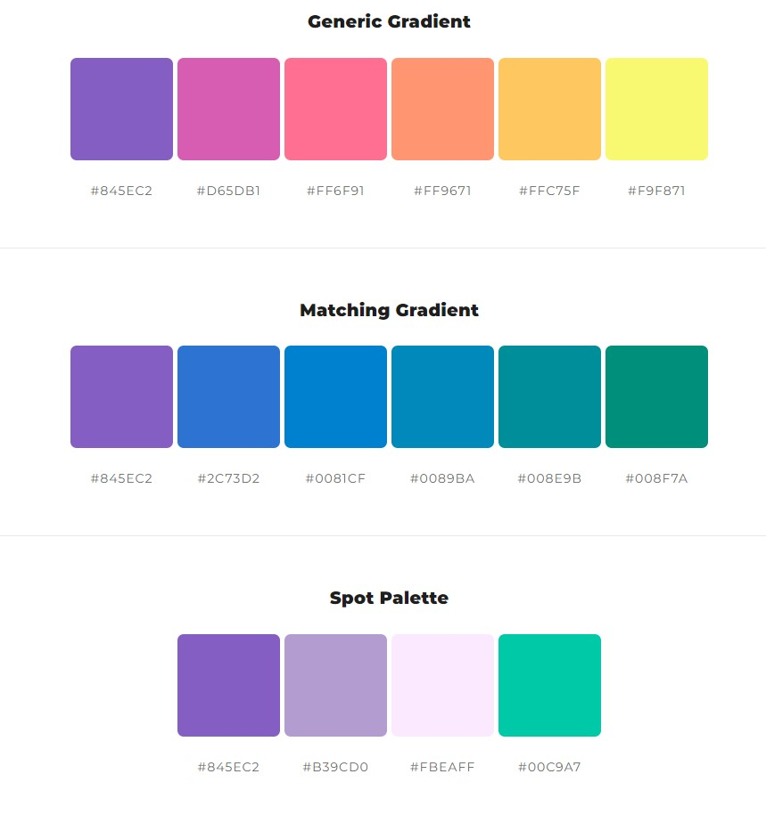

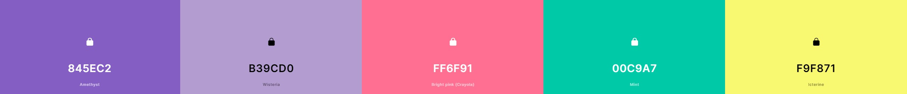

### Images

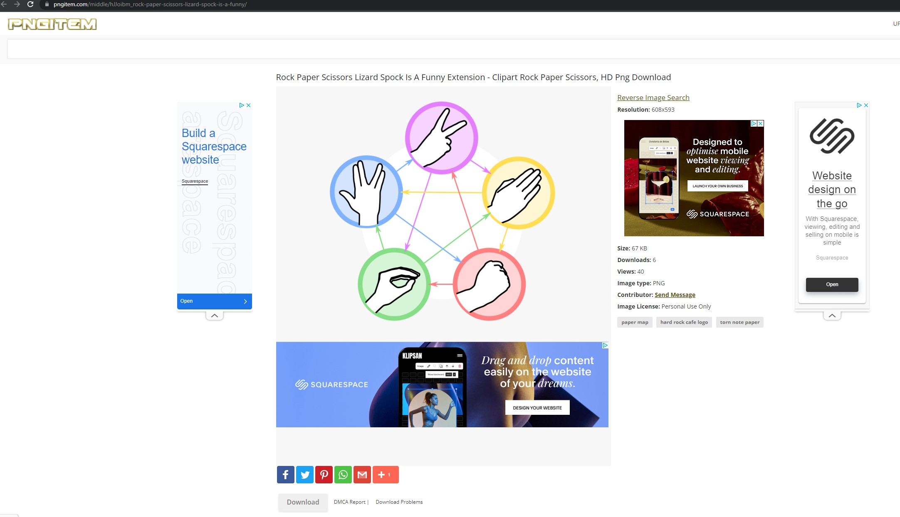

- Only image are taken from [pngitem](https://www.pngitem.com/middle/hJJoibm_rock-paper-scissors-lizard-spock-is-a-funny/) 
- Images are responsive. For desktop they align in a row across the desktop and as the screen becomes smaller the images wrap underneath ontop of one another. 

### Styling 
- For this project I primarily used HTML and CSS to structure and style the game website. 

----

# Features
### Index Page
- Only single page for this website.  
- This displays a clear message from what the website is about. 
- I used CSS Flexbox here to help center the main game in the center of the body of the html.

### Feature Ideas
#### Future Feature Ideas
- Possibly adding rounds in the game so user can play best out of 3 matches before resetting the game.

----

# Testing 
## Validation

- HTML has been validated with [W3C HTML5 Validator](https://validator.w3.org/).

    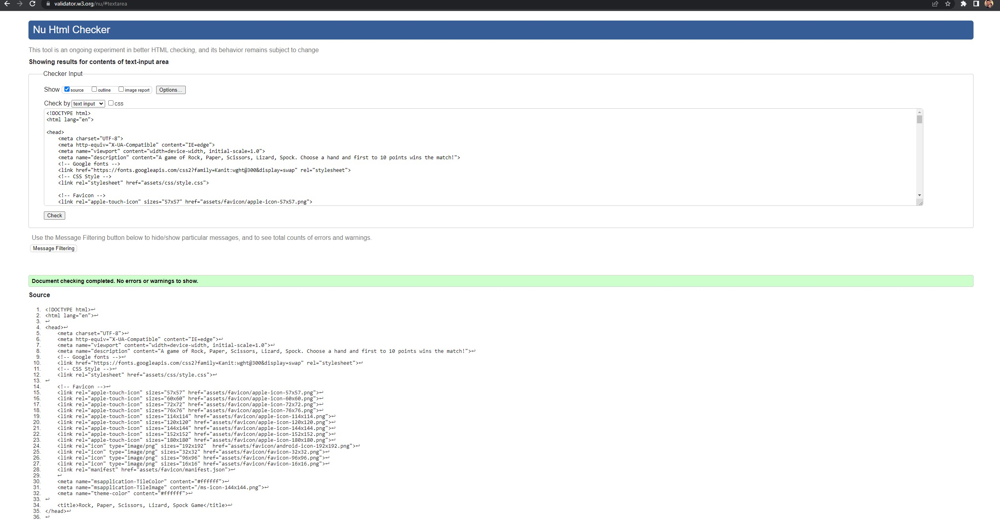

- CSS has been validated with [W3C CSS Validator](https://jigsaw.w3.org/css-validator/)

    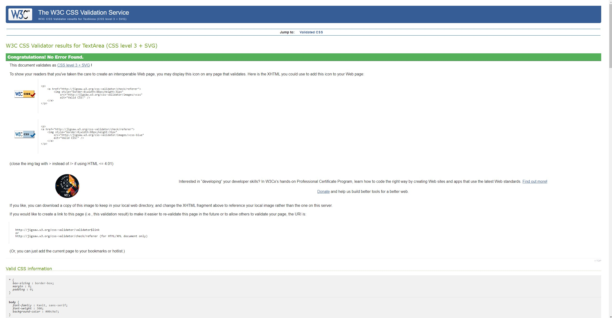

- Pass JavaScript through [Jshint](https://jshint.com/)

    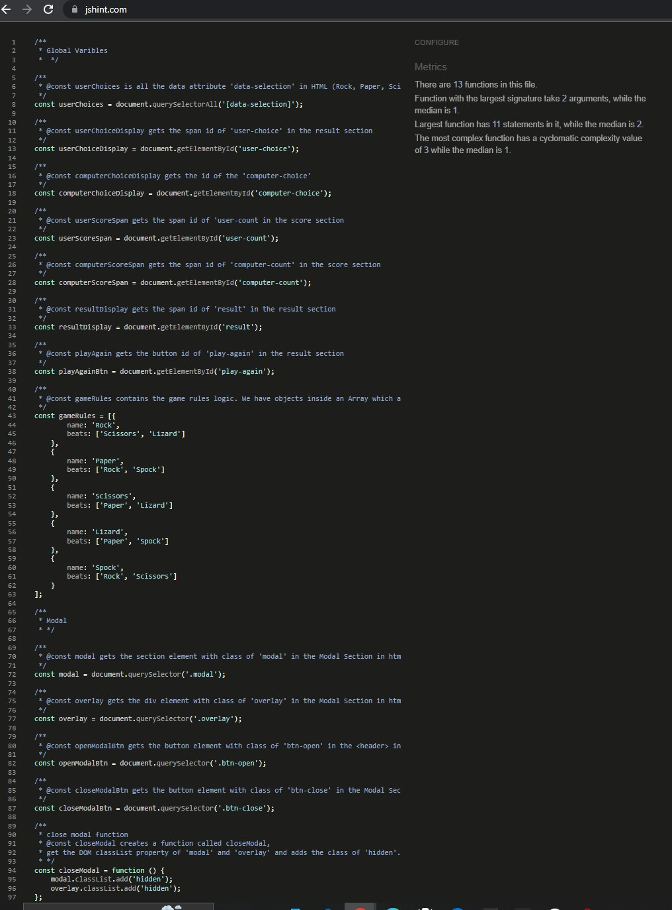

## PageSpeed Insights

- Tested performance on PageSpeed Insights [PageSpeed Insights](https://pagespeed.web.dev/)

    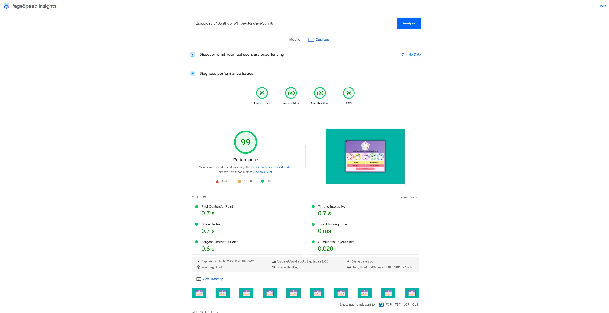

## General Testing

- Each time a feature was added, all the functions were tested to see if there was an impact.
- The site was sent to friends for feedback and testing.
- .gitignore file has been included to prevent system file commits.

----

# Deployment
## Git Hub

- The site was deployed to GitHub pages. The steps to deploy are as follows: 
- In the GitHub repository, navigate to the Settings tab 
- From the source section drop-down menu, select the Main Branch
- Once the main branch has been selected, the page will be automatically refreshed with a detailed ribbon display to indicate the successful deployment. 

The live link can be found here - https://joeyip13.github.io/Project-2-JavaScript/

---- 

# Credits 

- Code Institute - [Code Institute](https://github.com/Code-Institute-Org/gitpod-full-template)
I used Code Institute gitpod full template and HTML and CSS Essentials in the Full Stack Development course.
- W3 Schools - [W3 Schools](https://www.w3schools.com/)
- README.md for the template - https://github.com/Code-Institute-Solutions/readme-template
- Rory Patrick Sheridan README.md to help with structure content in my README.md - https://github.com/Ri-Dearg/horizon-photo/blob/master/README.md#page-elements
- Kevin Powell on YouTube - [Kevin Powell](https://www.youtube.com/@KevinPowell)
- Web Dev Simplified on YouTube - [Web Dev Simplified](https://www.youtube.com/@WebDevSimplified)
- modal - [freecodecamp](https://www.freecodecamp.org/news/how-to-build-a-modal-with-javascript/)

## Content 
- The remaining content was generated from myself.
- The icons in the game were taken from [Font Awesome](https://fontawesome.com/)

## Media

- Only image used are from Logo - [pngitem](https://www.pngitem.com/middle/hJJoibm_rock-paper-scissors-lizard-spock-is-a-funny/)

----

# Other Comments
My commits have been too big. My mentor (Rory Patrick Sheridan) has told me to break it down alot more in future commits.
This JavaScript Project has been the most difficult learning curve for me. At one point I did get stuck in a Tutorial Hell, where I was watching alot of tutorials and not grasping the understanding of the JavaScript Langauge. I am proud to have produced this game. 